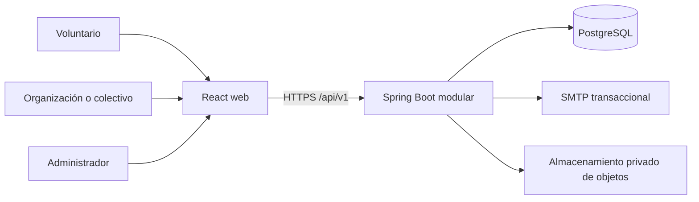

# Arquitectura y reglas de desarrollo

## Decisión de arquitectura

Dos repositorios con responsabilidades separadas: [hila-frontend](https://github.com/soul-labs-art/hila-frontend) contiene la interfaz, y este repositorio contiene API y persistencia. Se despliegan por separado y el backend usa una sola base PostgreSQL con un **monolito modular**. El tamaño del equipo y la etapa de validación no justifican operar microservicios. Los módulos se separan por capacidad de negocio y sus dependencias se mantienen explícitas; Spring Modulith puede verificar esa frontera.

## Tecnologías iniciales

- Java 17, Spring Boot 4.1.1, Maven Wrapper, Spring MVC, Spring Security, Bean Validation, Spring Data JPA, Flyway, PostgreSQL Driver, Actuator y Springdoc OpenAPI.
- PostgreSQL 18 como base relacional. Flyway administra cambios; `spring.jpa.hibernate.ddl-auto=validate` detecta desajustes.
- La interfaz usa React, TypeScript y Vite; su arquitectura y ejecución están documentadas en [hila-frontend](https://github.com/soul-labs-art/hila-frontend).
- El Docker Compose de este repositorio levanta PostgreSQL y la API. SMTP y almacenamiento de objetos se conectan mediante configuración; usar Mailpit y almacenamiento compatible con S3 al implementar esos adaptadores.
- La paleta, la tipografía y las reglas visuales están en la [guía de identidad visual del frontend](https://github.com/soul-labs-art/hila-frontend/blob/main/docs/IDENTIDAD_VISUAL.md).

## Módulos del backend

- **identity:** registro, sesiones, verificación de correo, consentimiento y roles globales.
- **volunteers:** perfil, habilidades, disponibilidad, territorios y recursos.
- **organizations:** registro formal o comunitario, membresías, revisión y suspensión.
- **opportunities:** causas, necesidades, publicación, catálogo y reglas de compatibilidad.
- **participation:** postulaciones, confirmaciones, cupos, participación, horas y resultados.
- **feedback:** valoraciones privadas vinculadas a una participación.
- **notifications:** bandeja interna y salida confiable de correo.
- **administration/audit:** catálogos, decisiones administrativas y trazabilidad.

Cada módulo expone casos de uso y tipos de entrada/salida. Controladores HTTP no contienen reglas de negocio; repositorios JPA permanecen dentro del módulo dueño de los datos. Las relaciones cruzadas deben pasar por interfaces o eventos del módulo, no por consultas arbitrarias a sus entidades.

## Contrato HTTP

Prefijo `/api/v1`. Grupos previstos: `/auth`, `/me`, `/organizations`, `/admin/organizations`, `/causes`, `/needs`, `/matches`, `/applications`, `/participation`, `/outcomes`, `/notifications`. El compromiso es parte del ciclo de una postulación, por lo que no requiere un recurso de asignación separado en la base. Mantener los DTO de request/response independientes de las entidades, validar en servidor y documentar con OpenAPI. El catálogo público solo entrega información de la necesidad apta para divulgación.

## Seguridad y privacidad

- Sesiones del servidor con cookie `HttpOnly`, `Secure` en HTTPS, `SameSite=Lax` y protección CSRF para operaciones que cambian estado. Evitar guardar tokens de acceso en `localStorage`.
- Contraseñas con Argon2id o el encoder fuerte soportado por Spring Security; verificar correo antes de postular.
- Los roles viven en `roles`. `user_roles` asignará roles globales `USER` y `ADMIN`; cada membresía de organización referencia `ORG_OWNER` o `ORG_COORDINATOR` del mismo catálogo y ámbito. La FK compuesta impide asignar un rol de plataforma a una membresía organizacional. Al implementar identidad, Spring Security cargará los códigos de rol desde la base; esa conexión de autenticación está pendiente. El backend comprobará además la organización y el recurso de cada solicitud. Los permisos se mantienen en las políticas del servidor mientras no exista una necesidad de configurarlos por administradores.
- Aprobación administrativa para organizaciones antes de publicar. Registrar quién decidió, cuándo y el motivo.
- Guardar consentimientos por tipo, versión y fecha. No almacenar la fecha de nacimiento en el MVP; conservar la declaración de mayoría de edad.
- Guardar archivos fuera de PostgreSQL. La tabla conserva clave de objeto y metadatos; descargas autenticadas mediante autorización del recurso y URL temporal.
- No hacer visibles públicamente ratings, evidencias, teléfonos privados, postulaciones ni historial individual.
- Aplicar Ley 1581/2012, su reglamentación y política institucional antes de tratar información real. La necesidad de inscripción, roles de responsable/encargado, plazos y atención de derechos debe validarse con el asesor institucional.
- La base inicial solo publica salud y Swagger para desarrollo; desactivar la documentación OpenAPI en el perfil de producción.

## Reglas de matching y transiciones

La compatibilidad se calcula al consultar una necesidad y devuelve criterios cumplidos/faltantes, sin guardar una puntuación opaca. Los filtros incluyen estado publicable, cupo, disponibilidad, modalidad, territorio, habilidades requeridas y recursos marcados como obligatorios. Criterios deseables solo ayudan a ordenar sugerencias. Coordinación decide cada asignación.

Necesidad: `DRAFT → PUBLISHED → CLOSED | CANCELLED`. Postulación: `APPLIED → ACCEPTED | REJECTED | WITHDRAWN`. Al aceptar y confirmar, una transacción comprueba el cupo y actualiza la misma postulación. Su `commitment_status` pasa por `NOT_CONFIRMED → CONFIRMED → COMPLETED | NO_SHOW | CANCELLED`. `participation_records` conserva las horas y su verificación; el historial de auditoría registra los cambios. Resultado de la necesidad: `FULFILLED | PARTIAL | NOT_FULFILLED`, con resumen registrado por la organización.

## Flujo de trabajo del equipo

- `main` siempre debe poder construirse. Crear ramas breves `feat/...`, `fix/...`, `docs/...`; integrar por pull request.
- Un cambio incluye su migración si modifica persistencia y actualiza requisitos, API, flujos o modelo ER cuando corresponda.
- Revisar seguridad y autorización junto con cada endpoint que lea o cambie datos privados.
- No añadir infraestructura o dependencias sin caso de uso documentado. Mantener secretos fuera de commits.
- Antes de integrar, revisar formato/compilación, migraciones desde base limpia y funcionamiento de las rutas afectadas. La documentación del repositorio es la fuente de verdad del comportamiento actual.
