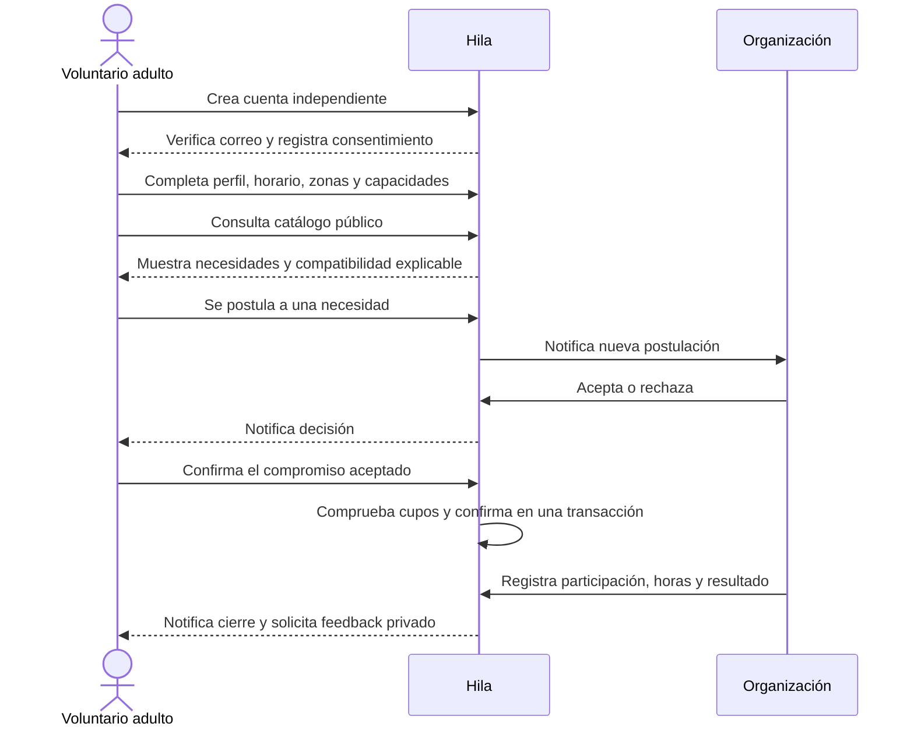
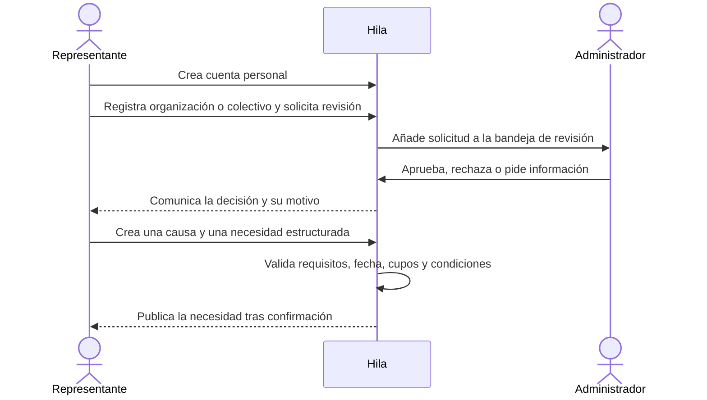

# Flujos del MVP

## Persona voluntaria

Una cuenta voluntaria puede existir antes de que haya organizaciones o actividades. En un catálogo vacío se explica cómo completar el perfil y se ofrece activar avisos de nuevas oportunidades. No se crean causas de muestra que puedan confundirse con necesidades reales.

## Organización formal o colectivo

La formalidad jurídica no es requisito universal del piloto: un colectivo comunitario sin NIT puede describir trayectoria, actividades y referencias de contexto para revisión manual. La organización controla qué publica y puede incorporar representantes a su equipo. La verificación acredita la idoneidad para publicar dentro del piloto, no constituye certificación legal del colectivo.

## Estados y excepciones

- Si no hay organizaciones aprobadas, voluntarios se registran y preparan perfil; no pueden postularse hasta existir una necesidad publicada.
- Si se agotan cupos mientras otra postulación está abierta, la confirmación vuelve a comprobar cupos en base de datos y actualiza la postulación dentro de una transacción.
- Rechazar o retirar antes de confirmar no crea actividad cumplida. Cancelar después de confirmar queda en historial con actor, fecha y motivo opcional.
- Una organización puede cerrar la necesidad como cumplida, parcial o no cumplida y asociar resumen y evidencia privada.
- La organización puede verificar horas/participación; una muestra podrá revisarla el equipo del piloto, pero el sistema deja claro quién hizo la verificación.
- El feedback es privado para el autor, coordinación autorizada y administración; no se publica como estrellas ni ranking.
