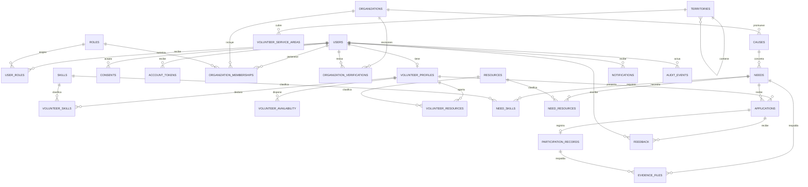

# Modelo de datos de Hila

PostgreSQL es la fuente de verdad. Las claves primarias son UUID; fechas y horas se guardan como `timestamptz`, y las actividades usan la zona `America/Bogota`. Flyway es el único dueño de los cambios de esquema; Hibernate queda en `validate`.

## Por qué hay 28 tablas en total

La primera versión tenía 27 tablas de dominio y el conteo de 28 incluía `flyway_schema_history`, tabla técnica de migraciones. La revisión agregó `roles` y `user_roles`, y retiró dos tablas 1:1 cuyo único registro dependía de otra entidad: `assignments` se integró a `applications` y el cierre único de una necesidad pasó a `needs`. El modelo queda en **27 tablas de aplicación más 1 técnica de Flyway: 28 en total**.

| Grupo | Tablas | Cantidad |
|---|---|---:|
| Identidad y acceso | `users`, `roles`, `user_roles`, `consents`, `account_tokens` | 5 |
| Capacidades y territorio | `volunteer_profiles`, `skills`, `volunteer_skills`, `volunteer_availability`, `territories`, `volunteer_service_areas`, `resources`, `volunteer_resources` | 8 |
| Organizaciones | `organizations`, `organization_memberships`, `organization_verifications` | 3 |
| Causas y necesidades | `causes`, `needs`, `need_skills`, `need_resources` | 4 |
| Participación y cierre | `applications`, `participation_records`, `evidence_files`, `feedback` | 4 |
| Operación | `notifications`, `email_outbox`, `audit_events` | 3 |
| **Total de aplicación** |  | **27** |

Las tablas de cruce evitan repetir datos cuando una persona tiene varias habilidades o territorios, y una necesidad admite varias habilidades o recursos. `causes` agrupa varias necesidades; `organization_verifications` conserva el historial de revisión; consentimiento, tokens y auditoría guardan información con ciclos de vida distintos. No se creó un catálogo para cada estado: los estados del flujo usan códigos acotados con restricciones `CHECK`.

Para simplificar el MVP, la postulación también lleva el estado del compromiso. El resultado único de cierre queda en `needs`, porque depende de esa necesidad y no tiene un ciclo independiente. `participation_records` se mantiene aparte porque registra horas y verificación por persona. Las notificaciones por correo quedan en `email_outbox` para reintentar entregas fallidas.

## Roles administrados en la base

`roles` guarda código, nombre, ámbito y estado activo. La migración siembra `USER` y `ADMIN` en ámbito `PLATFORM`, y `ORG_OWNER` y `ORG_COORDINATOR` en ámbito `ORGANIZATION`.

- `user_roles` asigna uno o más roles de plataforma a una cuenta. Cada cuenta recibe `USER`; el rol `ADMIN` se concede de forma controlada.
- `organization_memberships` vincula una cuenta con una organización y referencia un rol del ámbito `ORGANIZATION`.
- Las claves foráneas compuestas incluyen el ámbito, así la base no permite poner un rol global en una membresía organizacional.
- Los códigos y asignaciones viven en PostgreSQL. Al implementar el módulo de identidad, este asignará `USER` al crear cuentas y Spring Security cargará sus roles durante la autenticación; esa integración todavía está pendiente. El backend comprobará el alcance de cada organización y recurso. La matriz detallada de permisos permanece en código hasta que haya una necesidad real de administrarla desde una interfaz.

## Entidades y relaciones

## Responsabilidad de cada grupo

| Grupo | Datos que conserva |
|---|---|
| Identidad | `users` conserva cuenta y contraseña cifrada con hash; `consents` versiona aceptaciones; `account_tokens` almacena hashes de tokens temporales. Los roles y asignaciones se describen arriba. |
| Capacidades | `volunteer_profiles` guarda presentación y preferencias. Los catálogos `skills`, `resources` y `territories` se enlazan con habilidades, disponibilidad semanal, equipo y zonas mediante tablas específicas. |
| Organizaciones | `organizations` admite `FORMAL` y `COLLECTIVE`; un colectivo no necesita NIT. `organization_memberships` registra equipo y rol; `organization_verifications` conserva decisiones y motivos. |
| Oportunidades | `causes` agrupa trabajo de una organización. `needs` contiene actividad, horarios, modalidad, territorio, requisitos, cupos, publicación y su único resultado de cierre verificado. Las tablas `need_skills` y `need_resources` marcan requisitos obligatorios o deseables. |
| Participación | `applications` registra postulación, decisión y compromiso. `participation_records` registra horas y verificación por persona. `feedback` conserva evaluaciones privadas. |
| Operación | `evidence_files` guarda metadatos y clave privada del objeto; `notifications` mantiene avisos dentro de Hila; `email_outbox` permite reintentos de correo; `audit_events` conserva acciones sensibles. |

## Restricciones e índices principales

- Correo único sin distinguir mayúsculas; perfil voluntario único por cuenta; membresía única por `(organization_id, user_id)`; postulación única por `(need_id, volunteer_id)`; registro de participación único por postulación.
- La base limita los roles por ámbito y restringe estados, calificación de 1 a 5, cupos positivos, rangos de fecha y horarios semanales válidos.
- Solo una organización aprobada puede publicar. La confirmación comprueba y actualiza cupos dentro de una transacción para evitar sobreasignación concurrente.
- `evidence_files` referencia exactamente una necesidad cerrada o un registro de participación; el servicio valida tipo y tamaño antes de guardar en almacenamiento privado de objetos.
- Índices cubren el catálogo por estado/fecha, postulaciones por necesidad/persona, membresías, roles y avisos no leídos.
- El matching no persiste una puntuación opaca: calcula coincidencias y faltantes a partir de datos actuales.

## Migraciones

`V1__initial_schema.sql` crea las entidades base. `V2__database_roles_and_application_lifecycle.sql` introduce roles relacionales y fusiona el estado de asignación dentro de la postulación, preservando datos existentes. Las migraciones ya compartidas no se editan; cada cambio futuro se agrega en una migración nueva.
