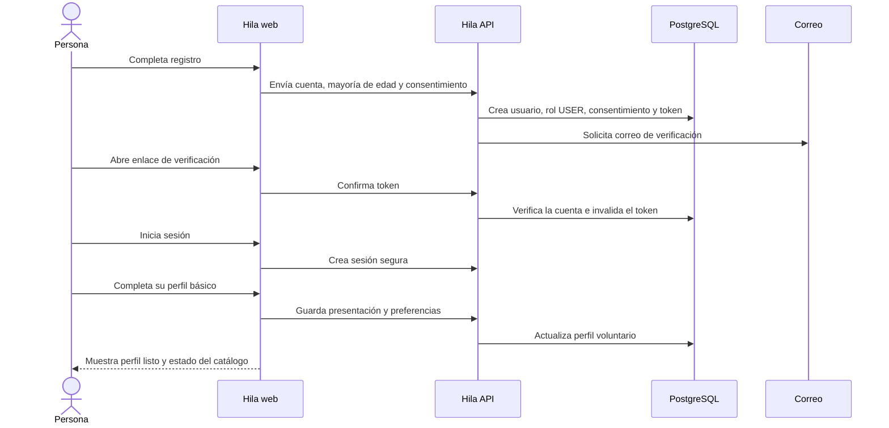

# Primer flujo vertical: registro y perfil voluntario

## Objetivo

Entregar el primer recorrido completo y utilizable de Hila: una persona adulta crea su cuenta sin depender de una organización, verifica su correo, inicia sesión y completa un perfil voluntario básico. Al terminar, ve un estado vacío honesto si todavía no existen oportunidades publicadas.

Este flujo valida identidad, consentimiento, sesión, perfil y comunicación entre frontend y backend antes de abordar organizaciones, necesidades y postulaciones.

## Recorrido de la persona

## Alcance funcional

1. Registro con nombre, correo normalizado, contraseña, declaración de mayoría de edad y aceptación de la versión vigente de la política de tratamiento.
2. Asignación automática del rol global `USER` desde el catálogo de roles de PostgreSQL.
3. Envío y consumo de un enlace de verificación de correo con token de un solo uso, almacenado como hash y con vencimiento.
4. Inicio y cierre de sesión mediante cookie segura administrada por el servidor.
5. Perfil voluntario inicial con presentación, profesión u oficio opcional, modalidad preferida y disposición para recibir avisos.
6. Consulta de la propia cuenta y perfil para restaurar la sesión y mostrar el avance.
7. Estado vacío cuando no hay necesidades publicadas, sin crear datos o convocatorias ficticias.

Las habilidades, horarios, territorios y recursos se incorporarán inmediatamente después como ampliaciones del perfil. Recuperación de contraseña, organizaciones, publicación de necesidades, compatibilidad y postulaciones quedan fuera de esta primera entrega.

## Contrato HTTP inicial

Todos los endpoints se versionan bajo `/api/v1`.

| Método y ruta | Uso | Acceso |
|---|---|---|
| `POST /auth/registrations` | Crear la cuenta y solicitar verificación | Público |
| `POST /auth/email-verifications` | Verificar el token recibido por correo | Público |
| `POST /auth/sessions` | Iniciar sesión y emitir la cookie | Público |
| `DELETE /auth/sessions/current` | Cerrar la sesión actual | Autenticado |
| `GET /me` | Consultar cuenta, roles y estado del perfil | Autenticado |
| `GET /me/volunteer-profile` | Consultar el perfil propio | Autenticado |
| `PUT /me/volunteer-profile` | Crear o actualizar el perfil propio | Autenticado |

El contrato OpenAPI definirá cuerpos, respuestas y errores antes de conectar la interfaz. Los errores usarán una estructura común con código estable, mensaje comprensible y detalle de campos cuando corresponda.

## Datos involucrados

- `users`: identidad, correo normalizado, hash de contraseña, mayoría de edad y estado de verificación.
- `roles` y `user_roles`: asignación del rol `USER`.
- `consents`: tipo, versión y fecha de aceptación.
- `account_tokens`: hash, propósito, vencimiento y consumo del token.
- `volunteer_profiles`: información básica y preferencias del perfil.
- `email_outbox`: entrega reintentable del correo de verificación.
- `audit_events`: eventos sensibles de cuenta y sesión sin registrar secretos.

## Criterios de aceptación

- Una persona puede registrarse aunque no exista ninguna organización ni necesidad en la plataforma.
- El servidor rechaza correos duplicados sin revelar información sensible y nunca almacena contraseñas o tokens en texto plano.
- No se crea la cuenta si falta la declaración de mayoría de edad o la aceptación de la versión vigente de la política.
- Una cuenta nueva recibe `USER`; el cliente no puede escoger ni elevar roles.
- El token de verificación vence, solo puede utilizarse una vez y su reenvío invalida o limita tokens anteriores según la política implementada.
- Antes de verificar el correo, la cuenta no puede completar acciones protegidas definidas para el piloto.
- El inicio de sesión crea una cookie `HttpOnly`, `Secure` en producción y `SameSite=Lax`; las operaciones de escritura están protegidas contra CSRF.
- La persona solo puede leer y modificar su propio perfil.
- Actualizar el perfil varias veces no crea perfiles duplicados.
- Si no hay oportunidades, la interfaz explica el estado y permite terminar el perfil; no muestra errores ni contenido ficticio.
- Los formularios funcionan con teclado, muestran errores junto al campo y conservan el foco de forma comprensible.
- Las pruebas del backend cubren registro, verificación, sesión, autorización y persistencia; el frontend cubre estados principal, carga, error y éxito del recorrido.

## Orden de implementación

1. Definir respuestas y errores en OpenAPI, política vigente de consentimiento y configuración de correo local.
2. Implementar registro, hash de contraseña, rol `USER`, consentimiento y outbox dentro de una transacción.
3. Implementar verificación de correo y controles de expiración y reutilización.
4. Implementar sesión, CSRF, `GET /me` y cierre de sesión.
5. Implementar consulta y actualización del perfil propio.
6. Construir las pantallas de registro, verificación, sesión y perfil usando el contrato publicado.
7. Validar el recorrido completo con PostgreSQL desde una base vacía y en vista móvil y escritorio.

## Definición de terminado

El flujo está terminado cuando puede recorrerse desde la interfaz contra la API real, las migraciones funcionan desde una base vacía, no se requieren datos manuales en PostgreSQL, el correo se prueba con un adaptador local, CI permanece verde y la documentación OpenAPI coincide con el comportamiento observado.
